# Laporan Proyek Machine Learning - Damar Syarafi Ramadhan
## :notebook: Latar Belakang
Industri ritel menghadapi tantangan besar dalam perencanaan stok dan pengelolaan inventori akibat dinamika tren musiman, perilaku konsumen, serta pengaruh promosi dan strategi pemasaran. Kemampuan memprediksi penjualan (sales forecasting) sangat penting untuk pengambilan keputusan bisnis yang efektif, seperti pengadaan barang, penentuan strategi promosi, dan manajemen rantai pasok. Penelitian Fildes et al. (2019) menunjukkan bahwa prediksi penjualan yang akurat dapat meningkatkan profitabilitas dan menurunkan biaya operasional. Integrasi data musiman dan pemasaran ke dalam model prediksi terbukti meningkatkan akurasi dibandingkan hanya menggunakan data historis penjualan.

Dataset yang digunakan, "Retail Sales Data with Seasonal Trends & Marketing" dari Kaggle, menyediakan data penjualan harian, tren musiman, dan aktivitas pemasaran—sangat relevan untuk membangun model time series forecasting yang mempertimbangkan faktor musiman dan promosi.

**:newspaper: Referensi:**
1. R. Fildes, P. Goodwin, M. Lawrence, and K. Nikolopoulos, "Effective forecasting and judgmental adjustments: An empirical evaluation and strategies for improvement in supply-chain planning," International Journal of Forecasting, vol. 35, no. 1, pp. 227–237, 2019.
2. S. Makridakis, E. Spiliotis, and V. Assimakopoulos, "Statistical and Machine Learning forecasting methods: Concerns and ways forward," PLOS ONE, vol. 13, no. 3, p. e0194889, 2018.

## :briefcase: Business Understanding
Dataset yang digunakan dalam proyek ini adalah "Retail Sales Data with Seasonal Trends & Marketing" yang tersedia di Kaggle abdullah0a/retail-sales-data-with-seasonal-trends-and-marketing. Dataset ini menyediakan data penjualan harian, tren musiman, serta aktivitas pemasaran, sehingga sangat relevan untuk membangun model time series forecasting yang mempertimbangkan faktor-faktor musiman dan promosi.

### :question: Problem Statements
1. Bagaimana memprediksi penjualan harian di masa depan dengan mempertimbangkan tren musiman dan aktivitas pemasaran?
2. Sejauh mana pengaruh fitur musiman dan pemasaran terhadap akurasi prediksi penjualan?

### Goals
1. Menghasilkan model time series forecasting yang mampu memprediksi penjualan harian secara akurat.
2. Mengidentifikasi fitur-fitur yang paling berpengaruh dalam meningkatkan akurasi prediksi penjualan.

### :bulb: Solution statements
- Menggunakan berbagai algoritma regresi yang diaplikasikan untuk melakukan time series forecasting: Linear Regresi, Ridge, Lasso, ElasticNet, XGB Regressor, untuk membandingkan performa prediksi penjualan harian menggunakan metrik evaluasi RMSE (Root Mean Squared Error) dan MAE (Mean Absolute Error).

## :mag_right: Data Understanding
[Retail Sales Data with Seasonal Trends & Marketing](https://www.kaggle.com/datasets/abdullah0a/retail-sales-data-with-seasonal-trends-and-marketing).

Kumpulan data ini memberikan wawasan terperinci tentang penjualan eceran, yang menampilkan berbagai faktor yang memengaruhi kinerja penjualan. Kumpulan data ini mencakup catatan tentang pendapatan penjualan, unit yang terjual, persentase diskon, pengeluaran pemasaran, dan dampak tren musiman dan hari libur.

    :mag_right: Jumlah baris dan kolom dalam dataset : 30000 baris dan 11 kolom (fitur).

### :card_index_dividers: Variabel-variabel pada Retail Sales Data with Seasonal Trends & Marketing dataset adalah sebagai berikut:
**Isi Dataset berisikan** :
- Store ID: Identifier toko jual.
- Product ID: Identifier per product.
- Sales Revenue (USD): Jumlah pendapatan yang didapat dari penjualan.
- Units Sold: Jumlah item produk terjual.
- Discount Percentage: Persentase Diskon yang dipasang pada produk tertentu.
- Marketing Spend (USD): Budget yang dikerahkan untuk promo marketing.
- Product Category: Kategori produk yang dijual (e.g., Electronics, Clothing).
- Date: Tanggal ketika penjualan terjadi.
- Store Location: Lokasi Geografis Toko.
- Day of the Week: Hari ketika penjualan terjadi.
- Holiday Effect: Indikator apakah penjualan terjadi selama periode liburan.

### Cek Nilai Null dan Duplicate
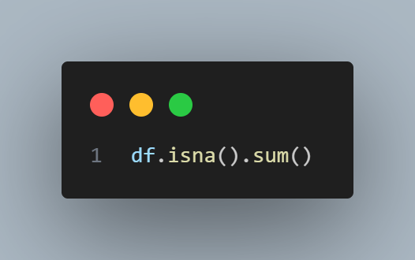

Dengan kode tersebut kita dapat menjumlahkan data null dan duplikat yang ada dalam data.
1. Duplicate() = Jumlah duplikat sebanyak 0 baris.
2. Isna() = Jumlah nilai null sebanyak 0 baris.

### Exploratory Data Analysis:
- Visualisasi tren penjualan harian untuk mengidentifikasi pola musiman.

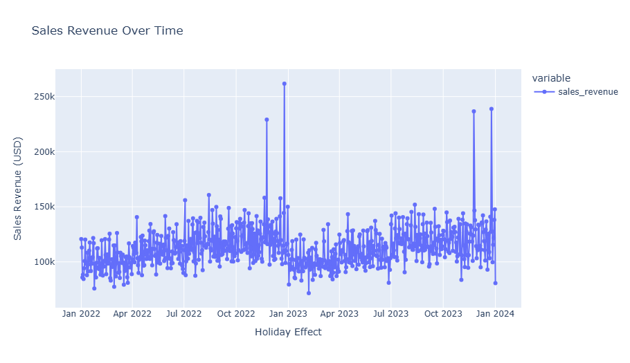

- Rata-rata Marketing untuk Masing Product

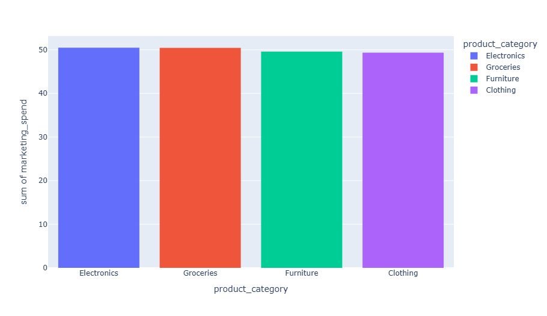

- Penjualan Produk Per Bulan (Berdasarkan Katalog Produk)

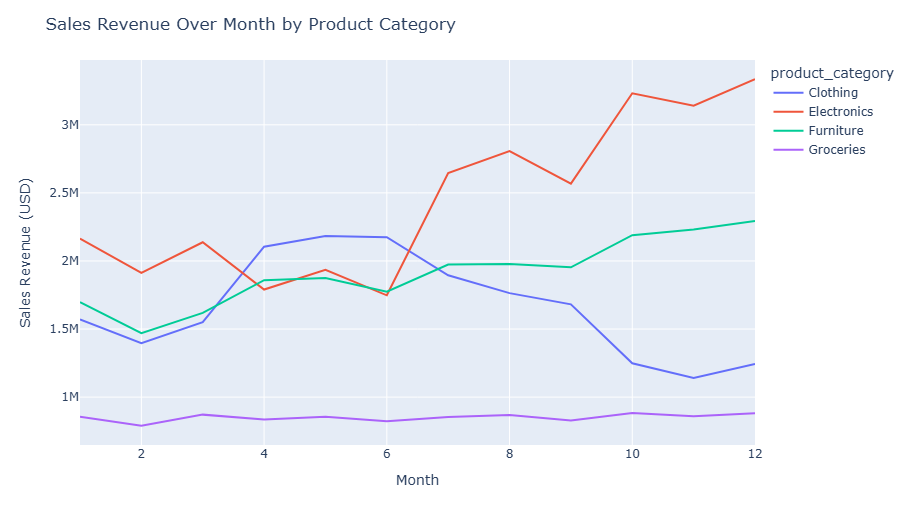

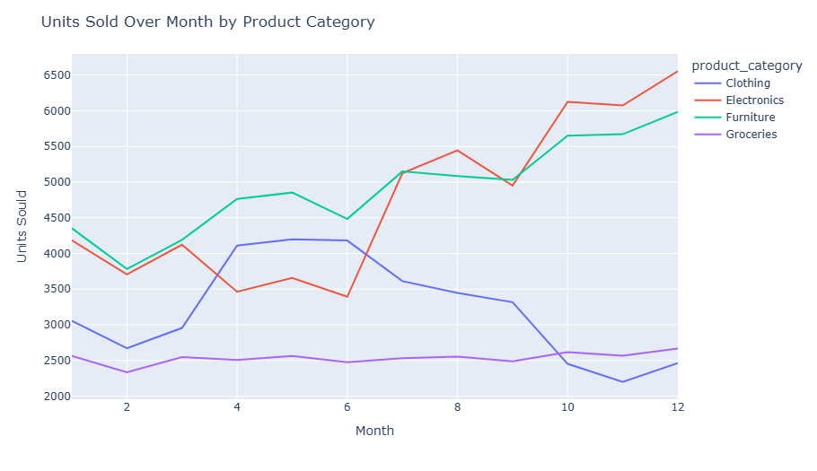

- Analisis korelasi antara fitur marketing_spend, promotion, season, dan sales.
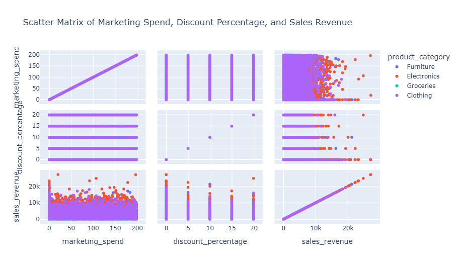

## Data Preparation
1. Handling Missing Values dan Duplikat: Mengisi nilai kosong atau menghapus baris nilai kosong dan duplikat.
2. Label Encoding: Menerapkan Labelisasi pada feature categorical sebagai representasi numerik.
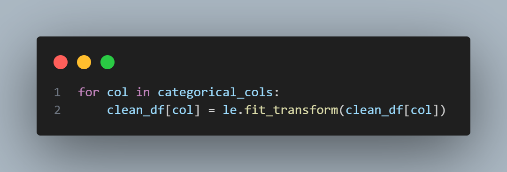

3. Scaling: Melakukan normalisasi pada fitur marketing_spend.
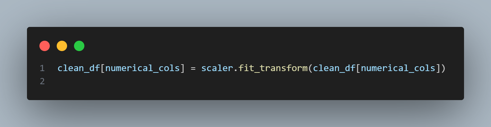

4. Remove Outlier: 
Outlier adalah nilai data yang secara signifikan berbeda dari nilai-nilai lain dalam kumpulan data. Outlier bisa disebabkan oleh kesalahan pengukuran, kesalahan entri data, atau variabilitas alami dalam data.
Metode IQR untuk menghapus outlier didasarkan pada gagasan bahwa nilai-nilai yang berada jauh di luar rentang pusat data (yang ditentukan oleh IQR) dapat dianggap sebagai outlier
    - Kuartil Pertama (Q1): Nilai di bawahnya terletak 25% data.
    - Kuartil Ketiga (Q3): Nilai di bawahnya terletak 75% data (atau 25% data terletak di atasnya).
    - IQR: Adalah perbedaan antara Kuartil Ketiga (Q3) dan Kuartil Pertama (Q1). IQR = Q3 - Q1

    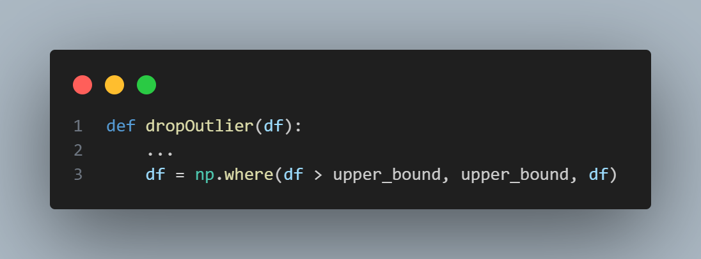

    Fungsi DropOutlier:
        - Menggunakan np.where untuk membatasi nilai-nilai dalam kolom:
        - Jika suatu nilai dalam kolom lebih besar dari upper_bound, nilai tersebut diganti dengan upper_bound.
        - Jika suatu nilai dalam kolom lebih kecil dari lower_bound, nilai tersebut diganti dengan lower_bound.
        - Fungsi ini mengembalikan kolom (Series) yang nilai outliernya sudah dibatasi.

5. :test_tube: Feature Engineering:
  - Ekstraksi fitur 'Date' yang memisahkan format date menjadi fitur : ['Day', 'Month','Year'].
  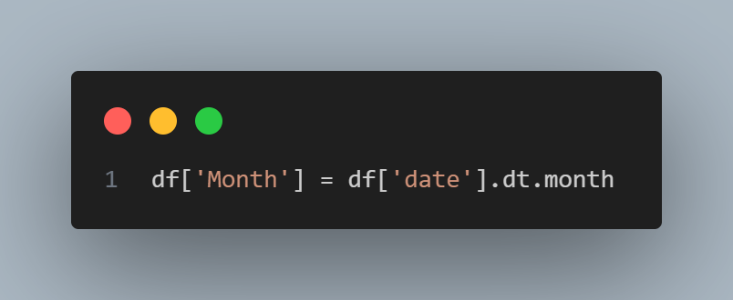

  - Membuat fitur lag sales:
  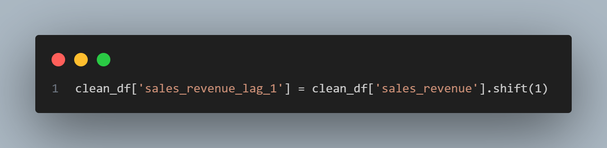

*Lag* merupakan hal mendasar dalam pemodelan deret waktu karena banyak pola bergantung pada pengamatan sebelumnya. Misalnya, model autoregresif (AR) memprediksi nilai masa depan menggunakan kombinasi linier dari nilai masa lalu, di mana setiap suku dalam model sesuai dengan lag.

6. Train-Test Split: Membagi data menjadi data train dan test secara time series (Bagian data yang lebih awal digunakan untuk pelatihan, dan bagian data yang lebih akhir digunakan untuk pengujian).
**Variabel Utama:**  
- **Target**: `Sales Revenue (USD)`  
- **Fitur**:  
  - `Units Sold`, `Discount Percentage`, `Marketing Spend (USD)`  
  - `Product Category` (kategori produk), `Date` (tanggal penjualan)  
  - `Holiday Effect` (indikator liburan), `Day of the Week` (hari dalam minggu) 

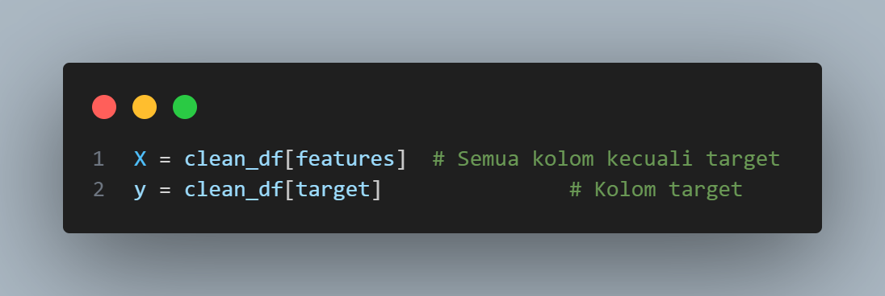

## Modeling
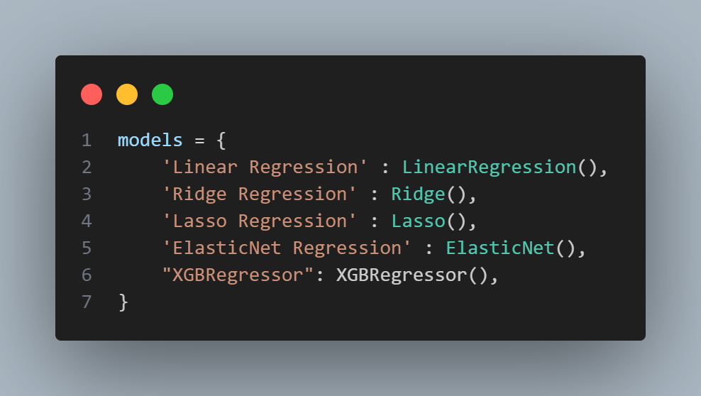
Setelah melakukan Train-Test Split, melakukan pendekatan dengan mencoba beberapa algoritma regresi yang berbeda untuk melihat mana yang berkinerja terbaik pada data.
Algoritma yang diimplementasikan untuk dievaluasi meliputi:
- **Linear Regression** : Dasar regresi yang menghubungkan fitur mempengaruhi target menggunakan persamaan linier, output seiring dengan perubahan input seperti hubungan jam belajar dengan hasil ujian.
- **Ridge Regression** : pengembangan dari linear regression dengan menambahkan regularisasi L2 pada fungsi loss-nya. Tujuannya untuk mengatasi masalah overfitting dan multikolinearitas dengan menambahkan penalti berupa kuadrat dari besaran koefisien regresi.
- **Lasso Regression** : Lasso Regression (Least Absolute Shrinkage and Selection Operator) juga merupakan pengembangan dari linear regression, tetapi menggunakan regularisasi L1. Lasso dapat mengecilkan beberapa koefisien regresi hingga nol, sehingga secara otomatis melakukan seleksi fitur.
- **ElasticNet Regression** : ElasticNet Regression menggabungkan regularisasi L1 (Lasso) dan L2 (Ridge) dalam satu model. Algoritma ini efektif untuk menangani dataset berdimensi tinggi, multikolinearitas, dan juga melakukan seleksi fitur. ElasticNet memungkinkan penyesuaian antara efek L1 dan L2 melalui parameter alpha, sehingga bisa menangani kasus di mana Lasso atau Ridge saja tidak optimal.
- **XGBRegressor** : XGBRegressor adalah algoritma regresi berbasis XGBoost (Extreme Gradient Boosting), yaitu teknik ensemble yang menggabungkan banyak pohon keputusan (decision tree) secara bertahap untuk meminimalkan error.

## Evaluation
### Mendefinisikan fungsi evaluate_model yang:
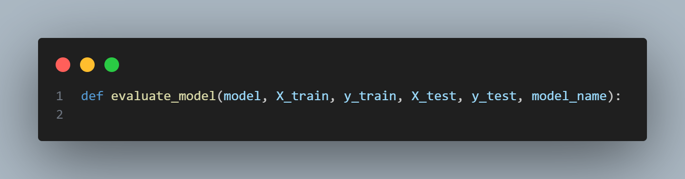
1. Menerima model, data pelatihan, dan data pengujian.
2. Melatih model menggunakan data pelatihan.

    | (model.fit(X_train, y_train)) |
    | --- | 
3. Melakukan prediksi pada data pengujian.

    | (model.predict(X_test)) |
    | --- |
4. Menghitung metrik evaluasi (r2_score dan mean_squared_error untuk mendapatkan RMSE).

    | test_r2 = r2_score(y_test, y_pred_test) |
    | --- |
5. Mencetak hasilnya.
6. Menyimpan hasilnya ke dalam daftar results.

### Evaluasi Hasil Model :
**Mengevaluasi setiap model menggunakan metrik R² dan RMSE.**
R² mengukur seberapa baik model menjelaskan varians dalam data target (semakin dekat ke 1, semakin baik).
RMSE (Root Mean Squared Error) mengukur rata-rata besar kesalahan prediksi model dalam unit yang sama dengan target (semakin rendah, semakin baik).

**Mengumpulkan hasil evaluasi dalam DataFrame results_df untuk perbandingan yang lebih mudah.**
| results_df = pd.DataFrame(results) |
| --- | 
**Mencetak hasil evaluasi untuk setiap model.**
| Models | R Squared Score (R²) | RMSE |
| --- | --- | --- | 
| Linear Regression | 0.6748 | 1342.9899
| Ridge Regression | 0.6748 | 1342.9773
| Lasso Regression | 0.6750 | 1342.5347
| ElasticNet Regression | 0.6525 | 1388.2127
| XGBRegressor  | 0.8314 | 966.8470

Setelah dilihat evaluasi masing-masing model, menggunakan model XGBRegressor menghasilkan skor R² yang tertinggi dari model yang lain. Maka XGBRegressor yang akan digunakan sebagai model regresi untuk melakukan ***Predictive Analytics* Time Series.**

### Plot Hasil Aktual vs Prediksi
Setelah membuat prediksi *Time Series Forecast* terhadap data test menggunakan model XGBRegressor, dibuat plot tren menggunakan plot scatter terhubung dengan garis yang dibentuk dari dataframe hasil prediksi, lalu menggunakan *groupby* untuk membuat grup pendapatan penjualan aktual vs prediksi dengan menjumlahkan sebaran titik data menurut index **date**.

| plotting = plot_df.groupby('date').agg({'Actual Sales Revenue': 'sum', ... |
| --- | 

Plot yang dihasilkan:
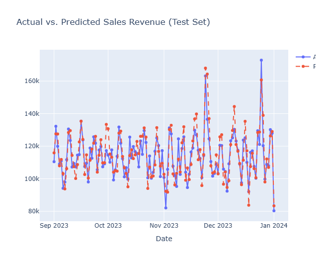

## :question: Menjawab Problem Statements 
1. Bagaimana memprediksi penjualan harian di masa depan dengan mempertimbangkan tren musiman dan aktivitas pemasaran?
Answer : 
2. Sejauh mana pengaruh fitur musiman dan pemasaran terhadap akurasi prediksi penjualan?
Answer :  Berdasarkan hasil evaluasi model XGBoost (model_ts) pada data uji (X_test_ts, y_test_ts):
- Setelah menyertakan fitur musiman seperti 'Day', 'Month', 'Year', serta menggunakan pendekatan deret waktu (sales_revenue_lag_1 dan pembagian data kronologis) berkontribusi pada akurasi prediksi.
- Korelasi dengan Marketing Spend : Anggaran yang lebih tinggi kemungkinan besar menarik perhatian pelanggan ke produk atau toko, penjualan menjadi tinggi dan otomatis pendapatan menaik drastis.
- Korelasi dengan Diskon : Diskon biasanya bertujuan untuk mengurangi unit yang tersedia di gudang agar tidak over capacity sehingga mengurangi harga produk dengan persentase ditentukan, dengan resiko pendapatan berkurang dari harga biasa product.

### 🎯 Goals 
1. Menghasilkan model time series forecasting yang mampu memprediksi penjualan harian secara akurat.
Answer : Berhasil dicapai setelah mencoba beberapa algoritma regresi, akhir model yang digunakan adalah XGBRegressor dengan skor R² = 0.83 menandakan model bekerja dengan baik.
2. Mengidentifikasi fitur-fitur yang paling berpengaruh dalam meningkatkan akurasi prediksi penjualan.
Answer : Setelah menyertakan fitur musiman seperti 'Day', 'Month', 'Year', serta menggunakan pendekatan deret waktu (sales_revenue_lag_1 dan pembagian data kronologis) berkontribusi pada akurasi prediksi. Dipadukan dengan visualisasi korelasi fitur antara marketing spend, diskon dihubungkan dengan pendapatan penjualan yang menggambarkan saling keterhubungan untuk menghasilkan output yang terbaik.

### Solutions Statement
Sesuai dengan perencanaan solusi yang diaplikasikan ke dalam pengerjaan model, pertama kita mencoba dan membandingkan hasil evaluasi R² dan RMSE kita dapat mempertimbangkan model yang cocok untuk dipakai yaitu XGBRegressor yang mampu memprediksi bagaimana tren musiman penjualan dari data tersebut.

**---Ini adalah bagian akhir laporan---**