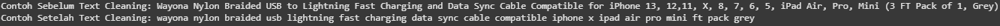
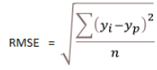
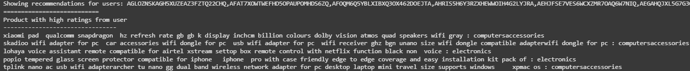

# Laporan Proyek Machine Learning - Damar Syarafi Ramadhan
## :notebook: Latar Belakang
Sistem rekomendasi produk merupakan komponen penting dalam platform e-commerce seperti Amazon untuk meningkatkan pengalaman pengguna dan penjualan. Dengan banyaknya produk dan data transaksi yang tersedia, sistem rekomendasi dapat membantu pengguna menemukan produk yang relevan dan sesuai preferensi mereka. Proyek ini bertujuan membangun sistem rekomendasi produk Amazon menggunakan data pembelian dan review pelanggan dari dataset Kaggle (amazon-sales-dataset). Pendekatan yang digunakan meliputi content-based filtering, collaborative filtering, dan hybrid filtering untuk mengoptimalkan akurasi rekomendasi.

Sistem rekomendasi yang efektif dapat meningkatkan kepuasan pelanggan dan loyalitas, serta mendorong peningkatan penjualan (lihat studi terkait di bidang e-commerce dan rekomendasi produk).

Dataset yang digunakan, "Amazon Sales Data" dari Kaggle, menyediakan data produk, review produk oleh user relevan untuk membangun model sistem rekomendasi yang mempertimbangkan produk yang cocok untuk direkomendasi untuk user berdasarkan review yang pernah diberikan oleh user atau berdasarkan kesamaan kategori produk yang pernah dibeli user.

## :newspaper: Referensi:
1. R. Fildes, P. Goodwin, M. Lawrence, and K. Nikolopoulos, "Effective forecasting and judgmental adjustments: An empirical evaluation and strategies for improvement in supply-chain planning," International Journal of Forecasting, vol. 35, no. 1, pp. 227–237, 2019.
2. S. Makridakis, E. Spiliotis, and V. Assimakopoulos, "Statistical and Machine Learning forecasting methods: Concerns and ways forward," PLOS ONE, vol. 13, no. 3, p. e0194889, 2018.

## :briefcase: Business Understanding
Dataset yang digunakan dalam proyek ini adalah "Retail Sales Data with Seasonal Trends & Marketing" yang tersedia di Kaggle abdullah0a/retail-sales-data-with-seasonal-trends-and-marketing. Dataset ini menyediakan data penjualan harian, tren musiman, serta aktivitas pemasaran, sehingga sangat relevan untuk membangun model time series forecasting yang mempertimbangkan faktor-faktor musiman dan promosi.

### :question: Problem Statements
1. Bagaimana memberikan rekomendasi produk yang relevan kepada pengguna berdasarkan riwayat pembelian dan review mereka?
2. Bagaimana menggabungkan informasi produk (content) dan perilaku pengguna (collaborative) untuk meningkatkan kualitas rekomendasi?
3. Bagaimana mengatasi keterbatasan masing-masing metode filtering untuk menghasilkan sistem rekomendasi yang optimal?

### Goals
1. Membangun sistem rekomendasi berbasis content filtering yang memanfaatkan fitur produk dan review.
2. Membangun sistem rekomendasi berbasis collaborative filtering berdasarkan pola pembelian dan rating pengguna.
3. Mengembangkan model hybrid filtering yang menggabungkan kedua pendekatan untuk meningkatkan akurasi rekomendasi.
4. Menyajikan rekomendasi top-N produk yang relevan bagi setiap pengguna.

### :bulb: Solution statements
1. Content-based filtering menggunakan fitur produk seperti kategori, deskripsi, dan review teks untuk menentukan kemiripan produk.
2. Collaborative filtering menggunakan matriks interaksi pengguna-produk (pembelian dan rating) untuk menemukan pola preferensi pengguna serupa.
3. Hybrid filtering menggabungkan skor dari kedua metode untuk mengatasi cold-start dan meningkatkan performa rekomendasi.

## :mag_right: Data Understanding
[Amazon Sales Dataset](https://www.kaggle.com/datasets/karkavelrajaj/amazon-sales-dataset).

    :mag_right: Jumlah baris dan kolom dalam dataset : 1465 baris dan 16 kolom (fitur).

### :card_index_dividers: Variabel-variabel pada Amazon Sales Dataset
Dataset Amazon Sales yang diambil dari Kaggle berisi informasi lengkap terkait produk dan ulasan pengguna, dengan **struktur variabel** sebagai berikut:
- product_id: ID unik produk
- product_name: Nama produk
- category: Kategori produk
- discounted_price: Harga produk setelah diskon
- actual_price: Harga asli produk sebelum diskon
- discount_percentage: Persentase diskon produk
- rating: Rating rata-rata produk
- rating_count: Jumlah pengguna yang memberikan rating
- about_product: Deskripsi produk
- user_id: ID pengguna yang memberikan review
- user_name: Nama pengguna yang memberikan review
- review_id: ID review pengguna
- review_title: Judul singkat review
- review_content: Isi review panjang
- img_link: Link gambar produk
- product_link: Link resmi produk di website Amazon
Dataset ini mencakup lebih dari 1.000 produk Amazon beserta detail rating dan review yang relevan, sehingga sangat cocok digunakan untuk analisis dan pengembangan sistem rekomendasi produk berbasis pembelian dan ulasan pengguna.

### Cek Nilai Null dan Duplicate
Hasil pengecekan tersebut kita dapat menjumlahkan data null dan duplikat yang ada dalam data:
- `Duplicate()` = Jumlah duplikat sebanyak 0 baris.
- `Isna()` = Jumlah nilai null sebanyak 2 baris pada kolom rating_count. Diatasi dengan manipulasi data dengan mengisi value baris sebelumnya(bfill).

### Exploratory Data Analysis:
1. Analisis Sentimen.

Terlihat mayoritas review produk yang dikeluarkan oleh user sangat positif, menunjukkan bahwa secara umum, pengguna memiliki pengalaman yang baik dan puas dengan produk-produk di dataset ini. Sentimen positif yang tinggi bisa menjadi salah satu faktor yang dipertimbangkan dalam sistem rekomendasi produk, menunjukkan popularitas atau kepuasan pengguna.
2. Top Kategori berdasarkan Jumlah Produk yang beredar di Amazon.

Pembelian yang paling banyak dibeli adalah produk elektronik, menunjukkan platform Amazon sangat dipercayai untuk penjualan barang elektronik yang diperlukan oleh user. Diikuti part *computer&accessories* yang dibeli oleh para antusias *PC builder*. Insight ini juga dikuatkan dengan analisis rata-rata `rating` setiap kategori produk yang dijual pada barang elektronik mendapatkan rata-rata `rating` **4.09**. Konsumen cenderung membeli barang elektronik dari platform yang dianggap terpercaya, menawarkan variasi produk yang luas, dan memiliki sistem pengiriman yang andal.

3. Rata-rata Diskon Setiap Kategori Product.

Barang *Home Improvement* mendapatkan rata-rata persentase diskon paling tinggi diantara semua kategori produk. Menunjukkan Produk di kategori *Home Improvement* mungkin memiliki margin keuntungan yang memungkinkan untuk menawarkan diskon yang lebih besar. Diskon tinggi bisa menjadi cara untuk menarik perhatian pelanggan ke kategori ini dan mendorong mereka untuk menjelajahi produk lain.
4. Heatmap Korelasi.

## Data Preparation
1. Mengatasi *Missing Values* pada Dataset
Karena adanya nilai kosong pada kolom `rating_count`, menggunakan metode manipulasi data dengan imputasi agar tidak kehilangan data yang relevan. 

2. :test_tube: Feature Engineering:
  - Mengubah Format *Currency* pada harga produk dan rating produk dikonversikan ke dalam bentuk float (decimal).
  

3. Text Cleaning:
  - Ekstraksi kategori utama yang mempunyai keturunan struktur kategori contoh: `Computers & Accessories -> Accessories -> Cables & Accessories -> Cables -> USB Cables`. Maka yang hanya diambil hanyalah Computers & Accessories.
  

  - *Lowercase*. : Mengubah semua huruf kapital menjadi huruf kecil.
  - Menghapus tanda baca dan karakter khusus yang tidak berkontribusi pada makna kata.
  - *Removal stopwords*Menghapus kata-kata umum yang tidak memiliki makna signifikan dalam analisis seperti "and", "the", "is", "in".
  - Lematisasi: Mengubah kata ke bentuk dasarnya (lemma) berdasarkan konteks, misalnya "running" menjadi "run", "better" menjadi "good".
  

4. Remove Outlier: 
Outlier adalah nilai data yang secara signifikan berbeda dari nilai-nilai lain dalam kumpulan data. Outlier bisa disebabkan oleh kesalahan pengukuran, kesalahan entri data, atau variabilitas alami dalam data.
Metode IQR untuk menghapus outlier didasarkan pada gagasan bahwa nilai-nilai yang berada jauh di luar rentang pusat data (yang ditentukan oleh IQR) dapat dianggap sebagai outlier
    - Kuartil Pertama (Q1): Nilai di bawahnya terletak 25% data.
    - Kuartil Ketiga (Q3): Nilai di bawahnya terletak 75% data (atau 25% data terletak di atasnya).
    - IQR: Adalah perbedaan antara Kuartil Ketiga (Q3) dan Kuartil Pertama (Q1). IQR = Q3 - Q1

      
    
    - Fungsi DropOutlier:

      
        - Menggunakan np.where untuk membatasi nilai-nilai dalam kolom:
        - Jika suatu nilai dalam kolom lebih besar dari upper_bound, nilai tersebut diganti dengan upper_bound.
        - Jika suatu nilai dalam kolom lebih kecil dari lower_bound, nilai tersebut diganti dengan lower_bound.
        - Fungsi ini mengembalikan kolom (Series) yang nilai outliernya sudah dibatasi.

        

5. Proses Text ke dalam bentuk Sentimen.

Contoh sederhana untuk mengklasifikasikan sentimen sebuah teks berdasarkan nilai polaritas (sentiment polarity) dari analisis sentimen, menggunakan perpustakaan seperti TextBlob atau yang serupa.
**Penjelasan Threshold Sentimen**
- **Positif** : Jika nilai polaritas lebih besar dari 0.1, dianggap teks memiliki sentimen positif.
- **Negatif** : Jika nilai polaritas kurang dari -0.1, teks dianggap memiliki sentimen negatif.
- **Netral** : Jika nilai polaritas berada di antara -0.1 dan 0.1 (inklusif), teks dianggap netral atau tidak memiliki sentimen yang kuat.

6. Label Encoding: Menerapkan Labelisasi untuk menandakan sentimen setiap review produk.

7. Drop Kolom yang kurang relevan untuk sistem rekomendasi seperti: ['discounted_price', 'actual_price', 'discount_percentage', 'review_id', 'review_title', 'user_name', 'img_link', 'product_link']

8. Ekstraksi Fitur Teks dengan TF-IDF.

Menerapkan TF-IDF (Term Frequency dan Inverse Document Frequency) Sasaran utamanya adalah mengevaluasi pentingnya sebuah kata pada sebuah dokumen. Biasanya, terdiri dari:
- Term Frequency (TF): mengukur seberapa sering sebuah istilah muncul dalam sebuah dokumen. Dihitung dengan membagi jumlah kemunculan sebuah istilah dalam sebuah dokumen dengan jumlah total istilah dalam dokumen tersebut.
- Inverse Document Frequency (IDF): mengukur pentingnya istilah di seluruh korpus. Dihitung dengan mengambil logaritma dari jumlah total dokumen dibagi dengan jumlah dokumen yang memuat istilah tersebut.

9. Train-Test Split: Membagi data menjadi data train dan test.

X adalah array NumPy yang berisi pasangan ID pengguna dan ID produk yang di-encode. Ini akan menjadi input fitur untuk model rekomendasi Anda, karena model akan belajar dari interaksi pengguna dengan produk tertentu. y adalah array NumPy yang berisi rating yang sudah dinormalisasi, dengan nilai dalam rentang [0, 1]. Ini akan menjadi target (label) untuk model Anda, karena model akan dilatih untuk memprediksi rating pengguna untuk produk tertentu (dalam rentang 0 hingga 1).
**Variabel Utama:**  
- **Target**: `rating`  
- **Fitur**:  
  - `user`
  - `product`

## Modeling
Setelah melakukan Train-Test Split, melakukan pendekatan dengan mencoba beberapa pendekatan sistem rekomendasi berbeda untuk melihat bagaimana masing-masing model bekerja.
Pendekatan yang diimplementasikan untuk diuji meliputi:
### 1. **Content-based Approach**
Pendekatan yang digunakan berdasarkan kesamaan deskripsi/kategori dari produk yang pernah dibeli/review oleh user pada platform. Setelah ekstraksi fitur teks menggunakan TF-IDF, menghitung *Cosine Similarity* antar produk untuk merekomendasikan item serupa dengan preferensi pengguna. 
Kesamaan kosinus adalah ukuran yang digunakan untuk menghitung tingkat kemiripan antara dua vektor dalam ruang berdimensi n dengan mengukur sudut kosinus antara kedua vektor tersebut.

### 2. **Collaborative Approach**

Membuat matriks yang setiap barisnya mewakili pengguna (user) dan setiap kolomnya mewakili produk (product).Nilai dalam matriks menunjukkan interaksi antara pengguna dan produk (misalnya, rating, jumlah pembelian, atau indikasi biner jika pengguna membeli produk tersebut).

Dalam Percobaan *training* model dengan dataset, dalam *collaborative approach* membangun fungsi kelas `RecommenderNet` yang berisi *layers* menggunakan keras tensorflow dengan parameter *embedding* yang diberikan berdasarkan jumlah user dan produk. Embedding berfungsi untuk mengubah jumlah user dan produk dalam bentuk integer diubah menjadi representasi vektor untuk pelatihan model nantinya.

**Parameter Model** :
- **embedding_size**: Ini adalah dimensi dari vektor embedding. Ukuran ini menentukan seberapa banyak informasi yang dapat disimpan dalam setiap vektor embedding. Nilai 50 digunakan di dalam kelas ini.
- **embeddings_initializer = 'he_normal'**: Ini menentukan bagaimana bobot awal (initial weights) dari embedding layer diinisialisasi. Inisialisasi 'he_normal' adalah metode yang umum digunakan untuk menghindari masalah gradien menghilang atau meledak selama pelatihan.
- **embeddings_regularizer = keras.regularizers.l2(1e-6)**: Ini adalah regularisasi L2 yang diterapkan pada bobot embedding. Regularisasi membantu mencegah overfitting dengan menambahkan penalti pada bobot yang besar.

Setelah membuat kelas *embedding*, kita membuat *call* menjelaskan bagaimana *embedding layer* dipanggil saat melakukan *forward pass*.

**Call Methode**:
- **user_vector = self.user_embedding(inputs[:,0])**: Layer user_embedding mengambil input integer yang merepresentasikan ID pengguna
- **user_bias = self.user_bias(inputs[:, 0])**: Layer user_bias mengambil ID pengguna dan mengembalikan nilai bias untuk setiap pengguna.
- **product_vector = self.product_embedding(inputs[:, 1])**: Serupa, product_embedding mengambil ID produk (inputs[:,1]) dan mengembalikan vektor embedding produk.
- **product_bias = self.product_bias(inputs[:, 1])**: Layer product_bias mengambil ID produk dan mengembalikan nilai bias untuk setiap produk.

Setelah membangun layer embedding dan model saatnya melatih model dengan data yang sudah dibagi X dan y dengan menggunakan fungsi RecommenderNet diisi parameter `num_users`, `num_product` dan ukuran embedding (*embedding_size*=50).
### 3. **Hybrid Recommendation** : 
Dalam fungsi `hybrid_recommendation`,sistem rekomendasi hibrida dengan mengintegrasikan pendekatan penyaringan berbasis konten dan kolaboratif.
- ID produk tertentu, kami akan mengidentifikasi produk serupa menggunakan penyaringan berbasis konten, yang memanfaatkan vektorisasi TF-IDF dari fitur produk untuk menghitung skor kesamaan kosinus dengan produk lain. Bagian sistem ini mengidentifikasi produk dengan fitur konten serupa.
- Sistem ini menggabungkan penyaringan kolaboratif dengan memeriksa peringkat produk target dan menemukan produk lain dengan peringkat dan kategori serupa, dengan asumsi bahwa produk dengan peringkat serupa mungkin menarik bagi preferensi pengguna yang serupa. 
- Kedua rangkaian rekomendasi ini (berbasis konten dan kolaboratif) kemudian digabungkan, menciptakan serangkaian rekomendasi beragam yang mempertimbangkan karakteristik konten produk dan pola peringkat pengguna. Output akhir adalah daftar produk teratas yang direkomendasikan berdasarkan metode hibrida ini.

## Evaluation
### 1. **Content-based Approach**
Hasil menggunakan *Content-based Approach*:
Contoh sampling nama produk yang akan digunakan sebagai sasaran percobaan: **instacuppa rechargeable mini electric chopper  stainless steel blades one touch operation for mincing garlic ginger onion vegetable meat nuts white ml pack of watts** yang merupakan barang elektronik dapur digunakan untuk mendadu makanan menggunakan *chopper*. Hasil Rekomendasi dari produk tersebut:

Hasil rekomendasi cukup mendekati karena beberapa rekomen merupakan barang elektronik dapur seperti : **borosil jumbo watt grill sandwich maker black**.

### 2. **Collaborative Approach**
Setelah pelatihan model dengan model `RecommenderNet`, evaluasi ukuran pelatihan menggunakan RMSE (Root Mean Squared Error), semakin rendah skor RMSE maka semakin baik indikasi model bekerja. Root mean square error (RMSE) digunakan secara luas sebagai ukuran kinerja dalam prediksi gerakan berkelanjutan. Ia mengukur perbedaan rata-rata titik data aktual dari nilai prediksi, dan perbedaannya dikuadratkan untuk menghindari pembatalan nilai positif dan negatif, saat keduanya dijumlahkan.

Hasil menggunakan *Collaborative Approach*:
| df[~df['product_id'].isin(product_bought_by_user.product_id.values)]['product_id'] |
| --- |
Mengambil sample ID Pengguna secara acak dari kolom `user_id`, membuat seri boolean dimana jika belum membeli produk tersebut, maka akan mengembalikan `True` untuk produk belum dibeli

Menggunakan model RecommenderNet yang telah dilatih untuk memprediksi rating untuk setiap pasangan pengguna-produk dalam user_product_array. Hasilnya adalah array NumPy dengan prediksi rating (dalam rentang 0 hingga 1).

Hasil yang dikeluarkan sebagai rekomendasi ke user:
Pengguna yang direkomendasikan.
Daftar 5 produk dengan rating tertinggi yang telah dibeli oleh pengguna (untuk perbandingan).
Daftar 10 produk yang direkomendasikan (berdasarkan prediksi rating tertinggi oleh model).

### 3. **Hybrid Approach**
Setelah membuat fungsi `hybrid_recommendation`, mengambil sample dari baris pertama dalam fitur `product_id`, `product_name` dan `category` yang dianggap pernah dibeli/review oleh user. Dalam konteks notebook, produk yang kita ambil: `agaro supreme high pressure washer  watts  bars lmin flow rate  meters outlet hose portable for carbike and home cleaning purpose black and orange`. setelah itu memanggil fungsi `hybrid_recommendation` menghitung `cosine_sim`, mencari barang yang mirip dengan rating barang tersebut dari review user dan berdasarkan kategori yang mendekati produk tersebut.
Hasil rekomendasi produk tersebut:
- Menyajikan daftar produk teratas (top-N) sebagai hasil rekomendasi hibrida.
- Rekomendasi ini mempertimbangkan baik karakteristik konten produk maupun pola peringkat pengguna.

  
## :question: Menjawab Problem Statements 
1. Bagaimana memberikan rekomendasi produk yang relevan kepada pengguna berdasarkan riwayat pembelian dan review mereka?
Answer: Kita dapat mengambil rekomendasi produk yang relevan dengan menggunakan beberapa fitur yang mendukung hasil dari pendekatan sistem rekomendasi seperti `product_id`, `user_id`, `rating`  
2. Bagaimana menggabungkan informasi produk (content) dan perilaku pengguna (collaborative) untuk meningkatkan kualitas rekomendasi?
Answer: Dengan menggunakan `Hybrid Recommendation`, kita dapat menggabungkan konten produk dan perilaku pengguna dilihat dari review rating user kasih ke produk yang mereka pakai dan juga menyocokkan kategori produk yang mendekati dari review kategori produk tersebut.
3. Bagaimana mengatasi keterbatasan masing-masing metode filtering untuk menghasilkan sistem rekomendasi yang optimal?
Answer: Pendekatan `Hybrid Recommendation` menggabungkan `Content-Based` dan `Collaborative Filtering` untuk memanfaatkan kekuatan keduanya dan memitigasi keterbatasan masing-masing. Memulai dengan model hybrid dasar yang menggabungkan kesamaan konten (cosine_sim) dengan rating rata-rata produk (product_user_matrix).

### 🎯 Goals
|                                                      Goals                                                       |    Accomplished    |
| ---------------------------------------------------------------------------------------------------------------- | ------------------ |
| Membangun sistem rekomendasi berbasis content filtering yang memanfaatkan fitur produk dan review.               | :white_check_mark: |
| Membangun sistem rekomendasi berbasis collaborative filtering berdasarkan pola pembelian dan rating pengguna.    | :white_check_mark: |
| Mengembangkan model hybrid filtering yang menggabungkan kedua pendekatan untuk meningkatkan akurasi rekomendasi. | :white_check_mark: |
| Menyajikan rekomendasi top-N produk yang relevan bagi setiap pengguna.                                           | :white_check_mark: |
### Solutions Statement
1. Content-based filtering menggunakan fitur produk seperti kategori, deskripsi, dan review teks untuk menentukan kemiripan produk.
2. Collaborative filtering menggunakan matriks interaksi pengguna-produk (pembelian dan rating) untuk menemukan pola preferensi pengguna serupa.
3. Hybrid filtering menggabungkan skor dari kedua metode untuk mengatasi cold-start dan meningkatkan performa rekomendasi.

**---Ini adalah bagian akhir laporan---**